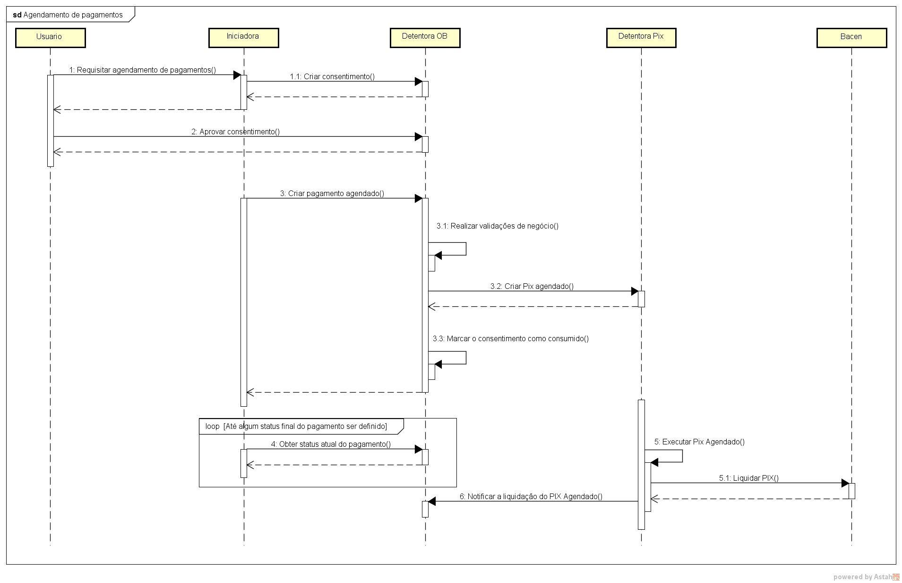
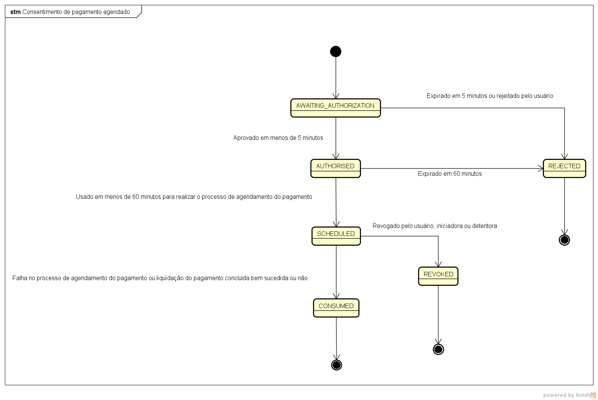
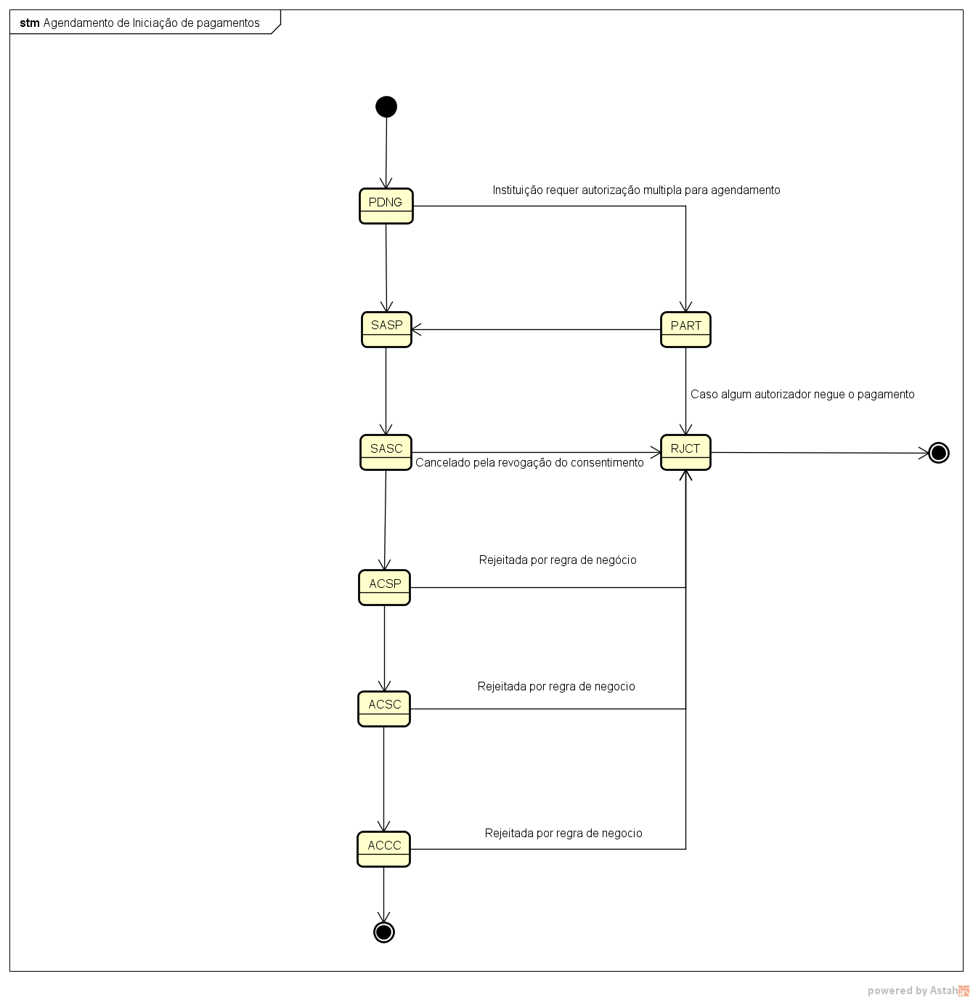
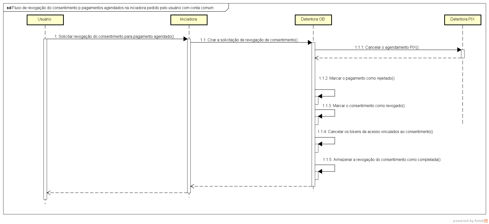
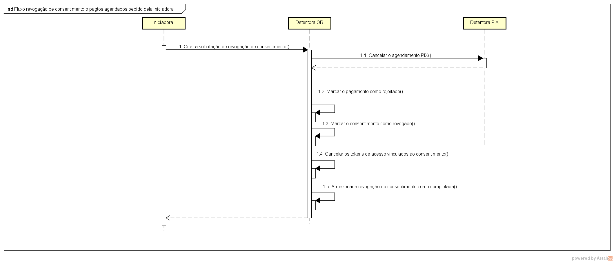
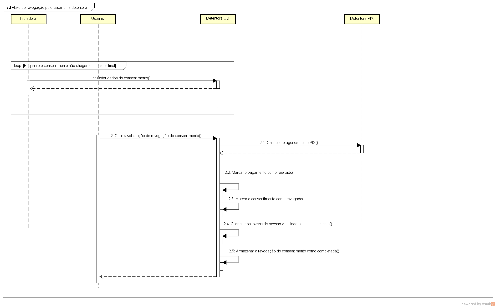
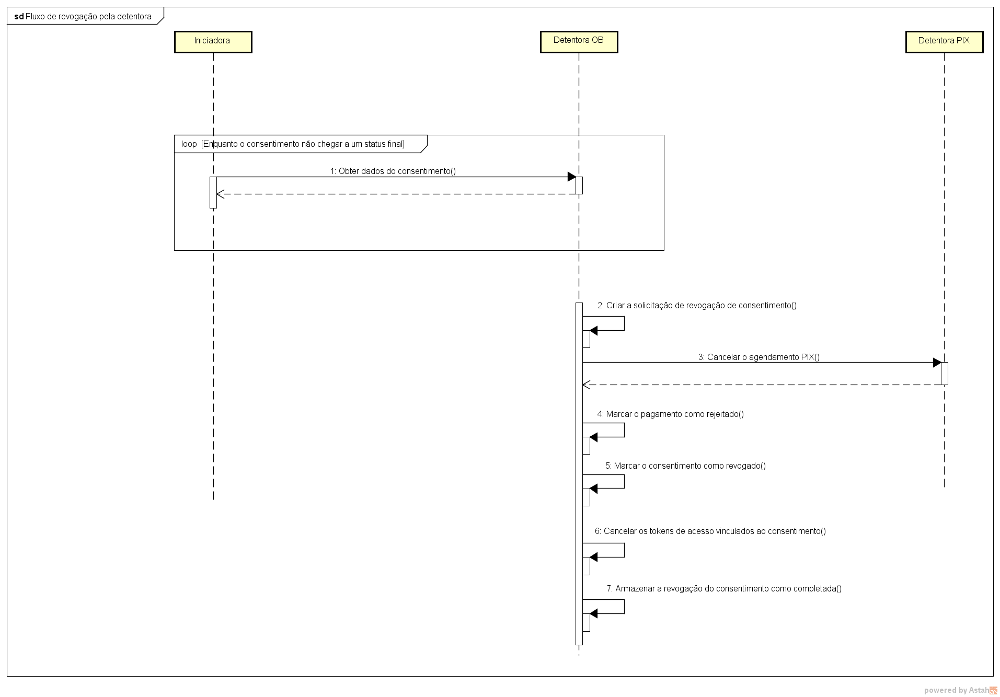
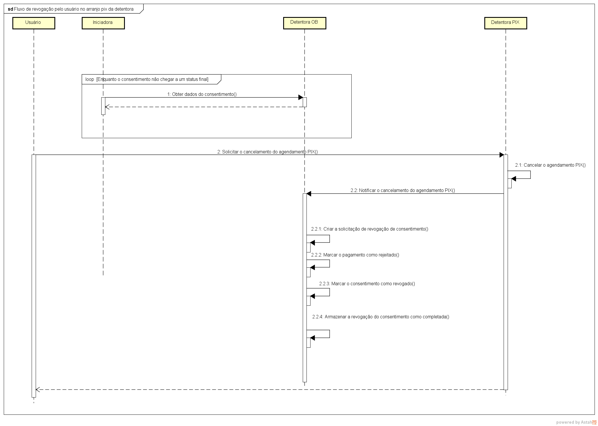

# Indices
- [Agendamento de iniciação de pagamentos](#agendamento-de-iniciação-de-pagamentos)
    - [Fluxo de agendamento de pagamentos](#fluxo-de-agendamento-de-pagamentos)
- [Ciclo de vida das entidades da iniciação de pagamentos](#ciclo-de-vida-das-entidades-da-iniciação-de-pagamentos)
- [Cancelamento de pagamento agendado](#cancelamento-de-pagamento-agendado)
- [Alterações no endpoint de criação de pagamentos](#alterações-no-endpoint-de-criação-de-pagamentos)
- [Controle de andamento de modificações no pagamento](#controle-de-andamento-de-modificações-no-pagamento)
- [Políticas de agendamento](#políticas-de-agendamento)
  - [Pagamento único](#política-de-agendamento-de-pagamento-único)
  - [Pagamento recorrente com frequência fixa](#política-de-agendamento-de-pagamento-recorrente-com-frequência-fixa)
  - [Pagamento recorrente por repetição](#política-de-agendamento-de-pagamento-recorrente-por-repetição)
  - [Pagamento recorrente por configuração *customizada*](#política-de-agendamento-recorrente-por-configuração-customizada)


# Agendamento de iniciação de pagamentos

Para possibilitar o agendamento único de pagamentos iniciados pelo Open Banking (OB) seria necessário a inclusão do conceito de "política de agendamento" no consentimento.  
A proposta aqui apresentada tem o canal OB sendo dependente do arranjo do produto final (Pix, TED, TEF, débito em conta) sendo chamado, pois, as regras/funcionalidade deles determinam como o OB é definido.  
Toda a especificação aqui proposta tem como diretriz base que a detentora seja responsável por zelar pelo agendamento conforme deliberado por votação do grupo de trabalho.  
Diante de todo o contexto mencionado é possível utilizar o próprio mecanismo de agendamento do Pix já definido para as detentoras de conta que são PSPs diretos/indiretos.  
Desse modo o cliente final participaria de toda a experiência que lhe é familiar para essa modalidade de pagamento como multiplas alçadas, extrato com lançamentos futuros, cancelamento de pagamento, etc.  

## Fluxo de agendamento de pagamentos

O fluxo de agendamento se dará a partir de um consentimento é criado normalmente com todas as regras do modelo atual e em seguida será solicitado a criação do pagamento agendado requisitado pela iniciadora.
O diagrama abaixo ilustra como se daria o fluxo de agendamento no contexto proposto.  
Vale lembrar que os fluxos no diagrama não são exaustivos, ou seja, não mostram todas as possibilidades de interação e arquitetura de solução.     



**Descrição do fluxo:**  
1. O usuário requisita o agendamento de pagamento junto a iniciadora derivado de algum fluxo de negócio entre eles
2. A iniciadora cria o consentimento do agendamento do pagamento junto a detentora
3. O usuário aprova o consentimento
4. A iniciadora solicita a detentora a criação do pagamento agendado
5. A detentora realiza as validações de negócio do consentimento contra o pagamento
6. A detentora cria o PIX agendado nos seus sistemas atuais que realizam este trabalho
7. A detentora marca o consentimento como agendado ([SCHEDULED](#ciclo-de-vida-do-consentimento))
8. A iniciadora inicia uma iteração (pooling) junto a detentora para acompanhar o ciclo de vida do pagamento
9. No dia agendado a detentora realiza a liquidação do PIX junto ao Bacen
10. A detentora atualiza o status do pagamento para completado ([ACCC](https://openbanking-brasil.github.io/areadesenvolvedor/#tocS_EnumPaymentStatusType))
11. A detentora atualiza o status do consentimento para consumido ([CONSUMED](https://openbanking-brasil.github.io/areadesenvolvedor/#tocS_EnumAuthorisationStatusType))
12. A iniciadora termina a iteração de acompanhamento do pagamento

O fluxo proposto tem como vantagens a não mudança da forma interação entre iniciadora e detentora hoje definido
além de já estar preparado para futuras adições de informação no pagamento de cunho único como, por exemplo, o **endToEndId**.
Com este fluxo serão necessárias adaptações futuras para suportar recorrência de pagamentos de valor fixo/variável também
incluído a questão de dados únicos mencionado anteriormente. Seria necessária ou a adaptação do endpoint atual para receber uma lista de pagamentos
ou implementar algum controle para multiplas requisições de pagamentos relacionadas a um mesmo consentimento.


# Ciclo de vida das entidades da iniciação de pagamentos

Para dar suporte a funcionalidade de agendamento de pagamentos o ciclo de vida do consentimento e do pagamento deverão ser expandidos
conforme o apresentado nas sessões subsequentes.

## Ciclo de vida do consentimento

O consentimento ganhará dois novos status como descrito a seguir para suportar a funcionalidade agendamento.
1. **SCHEDULED** : Indicará que o processo de agendamento ocorreu
2. **REVOKED** : Indicará que o consentimento foi revogado a pedido de alguma das partes (Usuário, iniciadora ou detentora) e com isso, 
o agendamento do pagamento será cancelado.

Caso haja alguma falha no processo de agendamento do pagamento o consentimento deverá ser marcado como [CONSUMED](https://openbanking-brasil.github.io/areadesenvolvedor/#tocS_EnumAuthorisationStatusType)
Tanto em caso de sucesso ou falha na liquidação do pagamento no dia agendado (Esgotando as possíveis retentativa da detentora no segundo caso) 
o consentimento deve ser marcado como [CONSUMED](https://openbanking-brasil.github.io/areadesenvolvedor/#tocS_EnumAuthorisationStatusType) .  
Enquanto o consentimento estiver no status **SCHEDULED** será possível obter renovar tokens de acesso para os endpoints relacionado ao fluxo da funcionalidade.  
O processo de **revogação do consentimento** será detalhado numa sessão adiante neste documento.



## Ciclo de vida do pagamento

O pagamento ganhará dois novos status como descrito a seguir para suportar a funcionalidade de agendamento.
Com isso dois novos status listados abaixo deverão ser adicionados ao pagamento.
1. **SASP (SCHEDULE_ACCEPTED_SETTLEMENT_IN_PROCESS)** : Processo de agendamento de iniciação de pagamento aceita e em processamento
2. **SASC (SCHEDULE_ACCEPTED_SETTLEMENT_COMPLETED)** : Processo de agendamento de iniciação de pagamento concluído

O status **SASP** abri a possibilidade de o processo de agendamento ser feito assincronamente na detentora.
Isso será especialmente útil para o caso da detentora tiver diferentes sistemas para se comunicar de modo a realizar o agendamento.

Para suportar o cancelamento de um pagamento agendado oriundo da revogação do consentimento deverá ser adicionado o novo valor: **CONSENT_REVOKED** para o enumerado [EnumRejectionReasonType](https://openbanking-brasil.github.io/areadesenvolvedor/#tocS_EnumPaymentType).    
O **consentimento** deverá ser marcado como **SCHEDULED** ao fim do processo de agendamento bem-sucedido ou **CONSUMED** caso contrário.



# Retentativas de liquidação de pagamentos

O Open Banking tem como premissa não interferir nas regras dos arranjos com os quais ele se comunica, por isso,
políticas de retentativas de liquidação de pagamentos para os agendamentos PIX ficam a cargo das regras decorrentes do arranjo PIX.
Como o arranjo não define regras para isso, cada instituição tem a liberdade de implementar a política que melhor se adeque as suas necessidades.
A única coisa a ser ressaltada aqui é que os ciclos de vida do [pagamento](#ciclo-de-vida-do-pagamento) e do [consentimento](#ciclo-de-vida-do-consentimento) devem estar em harmonia com o processo de retentativa de liquidação 
da instituição.

# Revogação de consentimento para pagamentos agendados

Como premissa adotada pelo grupo que está discutindo essa proposta de funcionalidade em conformidade com o grupo de PRC,
o consentimento representa a intenção do usuário de realizar um pagamento, seja ele agendado ou não.  
Diante desse ponto de vista para se possibilitar o cancelamento de um pagamento agendado que ainda será liquidado se torna necessário
realizar uma ação de revogação em cima do consentimento anteriormente dado pelo usuário.  
O tema mostrou-se bem complexo e com várias implicações envolvendo todos os participantes do fluxo de vida do pagamento: usuário, detentora e iniciadora.  
Todos eles possuem a possibilidade de realizar esta revogação em circunstâncias específicas a cada um.    
O processo de revogação deve ter dados detalhados o suficiente para apoiar processos de disputa entre as partes e 
suportar jornadas de múltiplas alçadas de autorização visto que esse processo é totalmente 
simétrico ao fato de criar um consentimento que suporta tal possibilidade.  
Outro ponto importante apresentado é que esse processo deve ser o mais claro possível para todos os envolvidos o que acarreta
estratégias de comunicação eficientes do ponto de vista de experiência da funcionalidade. 
Isto posto, a proposta de solução aqui presente tenta englobar toda essa complexidade numa entidade que represente o processo iniciado contra um consentimento.

## Endpoint de revogação de consentimento

O endpoint abaixo será usado para criar uma revogação para um consentimento de pagamento agendado.
A revogação tem uma máquina de estados para suportar assincronismo na execução da revogação e contas que possuam mecanismo de múltipla alçada.
O campo **revoked_by** indica quem é o solicitante da revogação (usuário, iniciadora ou detentora). 
Caso a revogação seja solicitada pelo usuário, deverá ser informado dados de login do usuário, além disso,
ela estará sujeita ao mecanismo de múltipla alçada caso a conta a suporte.

### Regras de negócio
1. O consentimento de pagamento só pode ser revogado em caso de pagamento agendados, caso contrário o endpoint 
deverá retornar um erro de negócio com o código HTTP 422 e no payload de erro o código **OPERATION_NOT_SUPPORTED_BY_CONSENT_TYPE**. 
2. O consentimento de pagamento agendado só pode ser revogado até 1 dia antes da execução do pagamento, caso contrário o endpoint deverá retornar
um erro de negócio com o código HTTP 422 e no payload de erro o código **REVOCATION_TIME_LIMIT_EXCEEDED**.
3. O consentimento de pagamento agendado só pode ser revogado se estiver no status **[SCHEDULED](#ciclo-de-vida-do-consentimento)**, caso contrário o endpoint deverá retornar um erro de negócio com o código HTTP 422 e no payload do erro o código **OPERATION_NOT_ALLOWED_BY_STATUS**
4. Só pode haver uma requisição de agendamento em processamento ou completada para um dado consentimento de pagamento agendado, logo caso haja a tentativa de solicitar mais de uma revogação fora da regra descrita o sistema deverá retornar um erro de negócio com o código HTTP 422 e no payload de erro o código **REVOCATION_ALREADY_IN_PROCESS**. Deve-se atentar ao mecanismo de [idempotência](https://openbanking-brasil.github.io/areadesenvolvedor/#idempotencia) de chamadas antes aferir essa regra. 

### Autenticação

Para chamar o endpoint descrito nesta sessão é necessário a utilização dos tokens conseguidos 
através do processo de hybrid flow na criação do consentimento.

**POST - /payments/v1/consents/{consentId}/revocations**

**Payload de requisição**

```
{
   "data":{
      "loggedUser":{
         "document":{
            "identification":"11111111111",
            "rel":"CPF"
         }
      },
      "revoked_by":"USER",
      "reason":{
         "code":"OTHER",
         "additionalInformation":"Não quero mais o serviço"
      }
   }
}
```

**Descrição dos campos da requisição**  

1. **data** : **Tipo**: objeto, **obrigatório**, **Descrição**: Campo que contém os dados a requisição de cancelamento
   1. **revoked_by** : **Tipo** : enumerado, **obrigatório**, **Descrição**: Descreve quem solicitou a revogação do consentimento. Valores: **USER** (Revogado pelo usuário), **ACCOUNT_HOLDER** (Dententora de conta), **INITIATOR** (iniciadora de pagamentos)
   2. **loggedUser** : **Tipo** : objeto, **obrigatório quando o campo revoked_by tiver o valour USER** , **Descrição**: Indica o usuário logado na instituição escolhida por ele (Detentora ou iniciadora) para realizar a revogação do consentimento. 
      1. **document**: **Tipo**: objeto, **obrigatório**, **Descrição**: Indica o documento de identificação do usuário.
         1. **identification**: **Tipo** : string, **obrigatório**, **Max length**: 11, **Pattern**: ^\d{11}$ , **Descrição**: Número do documento de identificação oficial do usuário.
         2. **rel**: **Tipo** : string, **obrigatório**, **Max length**: 3, **Pattern**: ^[A-Z]{3}$ , **Descrição** : Tipo do documento de identificação oficial do usuário
   3. **reason** : **Tipo** : objeto, **obrigatório**, **Descrição**: Razão da revogação do consentimento
      1. **code**: **Tipo** : enumerado, **obrigatório**, **Descrição**: Código do motivo da revogação do consentimento.   
      Valores:   
         1. **FRAUD** - Indica suspeita de fraude. Só deve ser usado quando o requisitante for a detentora ou iniciadora
         2. **ACCOUNT_CLOSURE** - Indica que a conta do usuário foi encerrada. Só deve ser usado quando o requisitante for a detentora ou iniciadora 
         3. **OTHER** - Indica que motivo do cancelamento está fora dos motivos pré-estabelecidos. O campo additionalInformation deverá descrever o motivo do cancelamento.   
      2. additionalInformation: **Tipo**: String, **obrigatório apenas quando o campo code for igual a OTHER**, **Max length**: 255, **Descrição** : Contém informações adicionais definidas pelo requisitante da revogação.   

**Parâmetros**  

1. **consentId** : **Origem**: path, **tipo**: string, **obrigatório**, **descrição**: O consentId é o identificador único do consentimento a ser revogado.
2. **Authorization** : **Origem**: header, **tipo**: string, **obrigatório**, **descrição**: Cabeçalho HTTP padrão. Permite que as credenciais sejam fornecidas dependendo do tipo de recurso solicitado
3. **x-fapi-auth-date** : **Origem**: header, **tipo**: string, **opcional**, **descrição**: Data em que o usuário logou pela última vez com o receptor. Representada de acordo com a RFC7231.Exemplo: Sun, 10 Sep 2017 19:43:31 UTC
4. **x-fapi-customer-ip-address**: **Origem**: header, **tipo**: string, **opcional**, **descrição**: O endereço IP do usuário se estiver atualmente logado com o receptor.
5. **x-fapi-interaction-id** : **Origem**: header, **tipo**: string, **opcional**, **descrição**: Um UID RFC4122 usado como um ID de correlação. Se fornecido, o transmissor deve "reproduzir" esse valor no cabeçalho de resposta.
6. **x-idempotency-key** : **Origem**: header, **tipo**: string, **obrigatório**, **Cabeçalho HTTP personalizado. Identificador de solicitação exclusivo para suportar a idempotência.**
7. **x-customer-user-agent** : **Origem**: header, **tipo**: string, **opcional**, **descrição**: Indica o user-agent que o usuário utiliza.

**Respostas**

**HTTP 201** : Ordem de cancelamento criada com êxito  
**payload de resposta**
```
{
   "data":{
      "revocationId": "d490493fff6e4fbd8a3eeb0cc247537c",
      "consentId":"urn:bancoex:C1DD33123",
      "creationDateTime":"2021-05-21T08:30:00Z",
      "statusUpdateDateTime":"2021-05-21T08:30:00Z",
      "status":"COMPLETED",
      "loggedUser":{
         "document":{
            "identification":"11111111111",
            "rel":"CPF"
         }
      },
      "revoked_by":"USER",
      "reason":{
         "code":"OTHER",
         "additionalInformation":"Não quero mais o serviço"
      }
   }
}
```

**HTTP 422** : A solicitação foi bem formada, mas não pôde ser processada devido à lógica de negócios específica da solicitação.
**Payload**:

```
{
  "errors": [
    {
      "code": "OPERATION_NOT_ALLOWED_BY_STATUS",
      "title": "Operação não permitida.",
      "detail": "Operação não permitida devido ao status atual do consentimento."
    }
  ],
  "meta": {
    "totalRecords": 1,
    "totalPages": 1,
    "requestDateTime": "2021-05-21T08:30:00Z"
  }
}
```
O payload deste erro segue a mesma estrutura descrita em [422ResponseErrorCreateConsent](https://openbanking-brasil.github.io/areadesenvolvedor/#tocS_422ResponseErrorCreateConsent),
com exceção do campo code que neste caso terá um tipo enumerado novo cujos valores possíveis serão: **OPERATION_NOT_SUPPORTED_BY_CONSENT_TYPE**,
**REVOCATION_TIME_LIMIT_EXCEEDED**, **OPERATION_NOT_ALLOWED_BY_STATUS**, **REVOCATION_ALREADY_IN_PROCESS**.

**Mensagens de erro**
1. code: **OPERATION_NOT_SUPPORTED_BY_CONSENT_TYPE**, title: Operação não suportada, details: Operação não suportada pelo tipo de consentimento
2. code: **REVOCATION_TIME_LIMIT_EXCEEDED**, title: Prazo limite para revogação excedido, details: Prazo limite para revogação excedido
3. code: **OPERATION_NOT_ALLOWED_BY_STATUS**, title: Operação não suportada, details: Operação não suportada para o status atual do consentimento
4. code: **REVOCATION_ALREADY_IN_PROCESS**, title: Revogação já em processamento, details: Revogação já em andamento.  

### Fluxo de revogação realizado pelo usuário na iniciadora

Abaixo é apresentado um diagrama do fluxo de revogação do consentimento realizado pelo usuário na iniciadora.  
Lembro que este diagrama não é exaustivo do ponto de vista de fluxos possíveis lidando apenas um fluxo síncrono e com conta sem múltiplas alçadas.   



### Fluxo de revogação realizado pela iniciadora

Abaixo é apresentado um diagrama do fluxo de revogação do consentimento realizado pela iniciadora sem a presença do usuário.  
O caso típico de uso deste fluxo seria para revogar por questões de fraude descoberta pela iniciadora. 
Lembro que este diagrama não é exaustivo do ponto de vista fluxos possíveis lidando apenas um fluxo síncrono.



### Fluxo de revogação pelo usuário na detentora na área de gestão do Open Banking

Abaixo é apresentado um diagrama do fluxo de revogação do consentimento realizado pelo usuário através da detentora na área de gestão do Open Banking.
Lembro que este diagrama não é exaustivo do ponto de vista de fluxos possíveis lidando apenas um fluxo síncrono e com conta sem múltiplas alçadas.
A iniciadora está monitorando o consentimento desde do momento da sua criação.  
Em um dado momento, o usuário resolve revogar o consentimento direto na detentora.  
Após o consentimento ser revogado a iniciadora obterá o status final do consentimento como revogado e irá parar o monitoramento.



### Fluxo de revogação pela detentora

Abaixo é apresentado um diagrama do fluxo de revogação do consentimento pela detentora sem a presença do usuário.
O caso típico de uso deste fluxo seria para revogar por questões de fraude descoberta pela detentora.
Lembro que este diagrama não é exaustivo do ponto de vista de fluxos possíveis lidando apenas um fluxo síncrono.
A iniciadora está monitorando o consentimento desde do momento da sua criação.  
Em um dado momento, a detentora resolve revogar o consentimento por questões de fraude, encerramento de conta e etc.  
Após o consentimento ser revogado a iniciadora obterá o status final do consentimento como revogado e irá parar o monitoramento.



### Fluxo de cancelamento de agendamento pelo usuário na detentora na área de arranjo PIX

Abaixo é apresentado um diagrama que mostra um fluxo que revoga o consentimento através do cancelamento de um agendamento de pagamento na área da detentora para o arranjo PIX.
Lembro que este diagrama não é exaustivo do ponto de vista de fluxos possíveis lidando apenas um fluxo síncrono e com conta sem múltiplas alçadas.
A iniciadora está monitorando o consentimento desde do momento da sua criação.  
Em um dado momento, o usuário resolve cancelar o agendamento do PIX na detentora o que desencadeia a revogação do consentimento vinculado a ele.    
Após o consentimento ser revogado a iniciadora obterá o status final do consentimento como revogado e irá parar o monitoramento.  



## Endpoint de busca de revogação

Este endpoint pode ser utilizado para obter os detalhes dos dados da revogação ou acompanhar o andamento do seu ciclo de vida.
Lembro que toda busca de informação deve ser filtrada pelo clientId da iniciadora conseguido na camada de segurança para evitar vazamento de informações.

**GET - /payments/v1/consents/{consentId}/revocations/{revocationId}**

**Parâmetros**  

1. **consentId** : **Origem**: path, **tipo**: string, **obrigatório**, **descrição**: O consentId é o identificador único do consentimento que foi revogado.
2. **revocationId**: **Origem**: path, **tipo**: string, **obrigatório**, **descrição**: O revocationId é o identificador único da revogação do consentimento. o valor do campo deverá ser preenchido com o UUID definido pela instituição de acordo com a RFC 4122 usando o versão 4.
3. **Authorization** : **Origem**: header, **tipo**: string, **obrigatório**, **descrição**: Cabeçalho HTTP padrão. Permite que as credenciais sejam fornecidas dependendo do tipo de recurso solicitado
4. **x-fapi-auth-date** : **Origem**: header, **tipo**: string, **opcional**, **descrição**: Data em que o usuário logou pela última vez com o receptor. Representada de acordo com a RFC7231.Exemplo: Sun, 10 Sep 2017 19:43:31 UTC
5. **x-fapi-customer-ip-address**: **Origem**: header, **tipo**: string, **opcional**, **descrição**: O endereço IP do usuário se estiver atualmente logado com o receptor.
6. **x-fapi-interaction-id** : **Origem**: header, **tipo**: string, **opcional**, **descrição**: Um UID RFC4122 usado como um ID de correlação. Se fornecido, o transmissor deve "reproduzir" esse valor no cabeçalho de resposta.
7. **x-customer-user-agent** : **Origem**: header, **tipo**: string, **opcional**, **descrição**: Indica o user-agent que o usuário utiliza.

**Respostas**  
**HTTP 200** : Revogação do consentimento obtida com êxito  
**payload de resposta**    
```
{
   "data":{
      "revocationId": "d490493fff6e4fbd8a3eeb0cc247537c",
      "consentId":"urn:bancoex:C1DD33123",
      "creationDateTime":"2021-05-21T08:30:00Z",
      "statusUpdateDateTime":"2021-05-21T08:30:00Z",
      "status":"COMPLETED",
      "loggedUser":{
         "document":{
            "identification":"11111111111",
            "rel":"CPF"
         }
      },
      "revoked_by":"USER",
      "reason":{
         "code":"OTHER",
         "additionalInformation":"Não quero mais o serviço"
      }
   }
}
```

### Autenticação

Para chamar o endpoint descrito nesta sessão é necessário pode se usar tanto os tokens conseguidos
através do processo de hybrid flow na criação do consentimento ou client credentials.

# Alterações no endpoint de busca de dados do consentimento

Com a possibilidade de revogação seria interessante realizar um vínculo semântico entre os dois recursos (consentimento e revogação)
pelo mecanismo do hateoas.
Para isso quando um consentimento estiver revogado pode ser adicionado na sessão links um vínculo semântico conforme demonstrado abaixo.

```
{
   "data":{
      "consentId":"urn:bancoex:C1DD33123",
      "creationDateTime":"2021-05-21T08:30:00Z",
      "expirationDateTime":"2021-05-21T08:30:00Z",
      "ibgeTownCode":"5300108",
      "statusUpdateDateTime":"2021-05-21T08:30:00Z",
      "status":"REVOKED",
      "loggedUser":{
         "document":{
            "identification":"11111111111",
            "rel":"CPF"
         }
      },
      "businessEntity":{
         "document":{
            "identification":"11111111111111",
            "rel":"CNPJ"
         }
      },
      "creditor":{
         "personType":"PESSOA_NATURAL",
         "cpfCnpj":"58764789000137",
         "name":"Marco Antonio de Brito"
      },
      "payment":{
         "type":"PIX",
         "date":"2021-01-01",
         "currency":"BRL",
         "amount":"100000.12",
         "ibgeTownCode":"5300108",
         "details":{
            "localInstrument":"DICT",
            "qrCode":"00020104141234567890123426660014BR.GOV.BCB.PIX014466756C616E6F32303139406578616D706C652E636F6D27300012\nBR.COM.OUTRO011001234567895204000053039865406123.455802BR5915NOMEDORECEBEDOR6008BRASILIA61087007490062\n530515RP12345678-201950300017BR.GOV.BCB.BRCODE01051.0.080450014BR.GOV.BCB.PIX0123PADRAO.URL.PIX/0123AB\nCD81390012BR.COM.OUTRO01190123.ABCD.3456.WXYZ6304EB76\n",
            "proxy":"12345678901",
            "creditorAccount":{
               "ispb":"12345678",
               "issuer":"1774",
               "number":"1234567890",
               "accountType":"CACC"
            }
         }
      },
      "debtorAccount":{
         "ispb":"12345678",
         "issuer":"1774",
         "number":"1234567890",
         "accountType":"CACC"
      }
   },
   "links":{
      "self":"https://api.banco.com.br/open-banking/api/payments/v1/consents/urn:bancoex:C1DD33123",
      "revocation":"https://api.banco.com.br/open-banking/api/payments/v1/consents/urn:bancoex:C1DD33123/revocations/06b3ec6220ac413fb4e1f0b12b0ff926"
   }
}
```

# Alterações no endpoint de criação de pagamentos para suportar o agendamento

Para suportar o agendamento de pagamentos deverá ser necessário saber quando o pagamento será executado.  
Com isso será necessário a inclusão de um campo de nome **date** no pagamento do tipo: **string(date)** sendo obrigatório.  
Esse novo campo deverá constar tanto na requisição: [CreatePixPaymentData](https://openbanking-brasil.github.io/areadesenvolvedor/#tocS_CreatePixPaymentData) 
quanto na resposta: [ResponsePixPaymentData](https://openbanking-brasil.github.io/areadesenvolvedor/#tocS_ResponsePixPaymentData) do endpoint de criação de pagamento.  
Para pagamentos agendados o valor deverá ser a data futura do pagamento. Para pagamentos normais deverá ser a própria data corrente.  
Este campo também será útil em futuras pesquisas de pagamentos em intervalos de datas sem considerar horário como expresso no campo **creationDateTime** hoje retornado na resposta da criação do pagamento.
No momento da criação do pagamento agendado a detentora deverá verificar a data informada no pagamento está de acordo com consentimento. Caso a regra seja violada a detentora deverá responder com o código HTTP 422
com o campo **code** com o valor **INCONSISTENT_PAYMENT_DATE** .  

### Exemplo de payload modificado ###

```
{
   "localInstrument":"DICT",
   "payment":{
      "date":"2022-12-10",
      "amount":"100000.12",
      "currency":"BRL"
   },
   "creditorAccount":{
      "ispb":"12345678",
      "issuer":"1774",
      "number":"1234567890",
      "accountType":"CACC"
   },
   "remittanceInformation":"Pagamento da nota XPTO035-002.",
   "qrCode":"00020104141234567890123426660014BR.GOV.BCB.PIX014466756C616E6F32303139406578616D706C652E636F6D27300012\nBR.COM.OUTRO011001234567895204000053039865406123.455802BR5915NOMEDORECEBEDOR6008BRASILIA61087007490062\n530515RP12345678-201950300017BR.GOV.BCB.BRCODE01051.0.080450014BR.GOV.BCB.PIX0123PADRAO.URL.PIX/0123AB\nCD81390012BR.COM.OUTRO01190123.ABCD.3456.WXYZ6304EB76\n",
   "proxy":"12345678901",
   "cnpjInitiator":"50685362000135",
   "transactionIdentification":"E00038166201907261559y6j6"
}
```

### Respostas ###
**HTTP 422 (Schema: https://openbanking-brasil.github.io/areadesenvolvedor/#schema422responseerrorcreatepixpayment)**
1. Introdução do valor: **"INCONSISTENT_PAYMENT_DATE"** no enumerado [EnumErrorsCreatePayment](https://openbanking-brasil.github.io/areadesenvolvedor/#tocS_EnumErrorsCreatePayment) usado no campo **"code"** já presente no payload de resposta para este tipo de erro.
2. Introdução da mensagem: **"Data de pagamento inconsistente."** no campo **"title"** caso o campo **"code"** tenha o valor definido no **item 1 desta lista**.
3. Introdução da mensagem: **"Data de pagamento inconsistente com relação ao definido no consentimento."** no campo **"details"** caso o campo **"code"** tenha o valor definido no **item 1 desta lista**.

# Controle de andamento de modificações no consentimento

Para a iniciadora acompanhar o andamento dos status do consentimnto ela deverá utilizar o mecanismo que hoje ela já usa para fazê-lo.
O mecanismo consiste em realizar um pooling no endpoint de busca do consentimento até o consentimento alcançar algum status final (CONSUMED, REJECTED, REVOKED).

# Políticas de agendamento

Refletindo as discussões no grupo de trabalho sobre o tema de agendamento e recorrência de pagamentos de valor fixo,  
fora entendido que um modelo de dados que permitisse a conclusão de datas de pagamento a partir de parâmetros e não de datas explícitas seria o  
mais adequado para maioria dos casos de uso. Além disso, verificou-se a necessidade que esses parâmetros deveriam expor de forma inequívoca, tanto para as iniciadoras quanto para as detentoras,  
como a recorrência de pagamentos deveria interpretada.
Com isso os modelos propostos foram revistos para estarem aderentes ao exposto além de permitir um maior nível de escolha pelos membros do grupo de trabalho  
quais *features* poderão ser adicionadas.

## Especificações

O campo **schedule** deverá ser adicionado ao payload de consentimento no objeto payment que hoje já compõe o mesmo.
Ele será um objeto onde a sua estrutura será descrita posteriormente neste documento.
Este campo será mutuamente exclusivo contra o campo **date** hoje já presente no objeto payment.
O campo **date** só será usado para pagamentos normais, ou seja, não agendados/recorrentes.
Caso os dois campos estejam presentes simultaneamente no payload da requisição, a detentora deve devolver uma **resposta HTTP 400**.

Observe o exemplo abaixo

### Exemplo de fragmento do payload de consentimento para pagamentos atual

```
{
  "data": {
    "payment": {
      "type": "PIX",
      "date": "2021-01-01",
      "currency": "BRL",
      "amount": "100000.12"
    }
  }
}
```

### Exemplo de fragmento do payload de consentimento para pagamentos agendados/recorrentes

```
{
   "data":{
      "payment":{
         "type":"PIX",
         "currency":"BRL",
         "amount":"100000.12",
         "schedule":{
            "single":{
               "date":"2035-01-01"
            }
         }
      }
   }
}
```

### Tipos de políticas de agendamento 

Quatro tipos de políticas de agendamento foram definidas com base nas discussões do grupo de trabalho:

1. Pagamento único
2. Pagamento recorrente com frequência fixa
3. Pagamento recorrente por repetição
4. Pagamento recorrente por configuração *customizada*

Todas as políticas de agendamento são mutuamente exclusivas entre si, ou seja, não podem coabitar a definição de um mesmo payload de consentimento para pagamentos simultaneamente.  
Caso isso ocorra a detentora deve retornar a **resposta HTTP 400** para a iniciadora.

## Política de agendamento de pagamento único ##

Essa política determina o agendamento de um pagamento único numa data futura.

#### Especificação ####

```
{
   "data":{
      "payment":{
         "type":"PIX",
         "currency":"BRL",
         "amount":"100000.12",
         "schedule":{
            "single":{
               "date":"2035-01-01"
            }
         }
      }
   }
}
```

A política de agendamento de pagamento único é introduzida pelo campo de nome **single** no objeto do campo **schedule** conforme mostrado no exemplo acima.  
Ela define a seguinte estrutura:

**Campos**  
  
1. **date** : **tipo**: string(date), **obrigatório**, **descrição**: Data do agendamento do pagamento. Essa data deve ser futura em relação ao dia do consentimento. 

Para o contexto de "UX", a intenção dessa política pode ser expressa para usuário final da seguinte forma: "Pagamento agendado para o dia {date}"

## Política de agendamento de pagamento recorrente com frequência fixa ##

```
{
   "data":{
      "payment":{
         "type":"PIX",
         "currency":"BRL",
         "amount":"100000.12",
         "schedule":{
            "fixed":{
               "startAt":"2022-08-10",
               "frequency":2,
               "count":3
            }
         }
      }
   }
}
```

Essa política determina **uma quantidade de pagamentos a ser realizada distribuída em uma frequência de datas futuras determinadas em dias corridos a partir de uma data inicial**.  
Esta política pode conter um campo de *delay* para determinar a partir de quando no futuro a recorrência iniciará.  
Caso não definido, **o dia atual do consentimento será assumido**.    
No exemplo teremos pagamentos em: 2022-08-12, 2022-08-14 e 2022-08-16.   

A política de agendamento de pagamento recorrente com frequência fixa é introduzida pelo campo de nome **fixed** no objeto do campo **schedule** conforme mostrado no exemplo acima.  
Ela define a seguinte estrutura:

**Campos**
  1. **startAt** : **tipo**: string(date), **opcional**, **valor padrão**: data atual do consentimento, **descrição**: Data de onde irá começar a contar a recorrência de pagamentos. Essa data deve ser futura ou igual ao dia do consentimento em questão.
  2. **frequency**: **tipo**: inteiro, **obrigatório**, **valor mínimo: 2**, **valor máximo**: 365, **descrição**: Frequência em dias corridos da recorrência de pagamentos.
  3. **count**: **tipo**: inteiro, **obrigatório**, **valor mínimo: 2**, **valor máximo**: 200, **descrição**: Quantidade de pagamentos a ser realizada a partir da data inicial de recorrência.

Para o contexto de "UX", a intenção dessa política pode ser expressa para usuário final da seguinte forma: "Pagamento recorrente agendado a cada {frequency} dias a partir da data {delay}"

Quatro tipos de políticas de agendamento foram definidas com base nas discussões do grupo de trabalho:

## Política de agendamento de pagamento recorrente por repetição ##

Para o contexto de "UX", a intenção dessa política pode ser expressa para usuário final da seguinte forma: "Pagamento recorrente agendado a cada {frequency} dias a partir da data {delay}"

```
{
   "data":{
      "payment":{
         "type":"PIX",
         "currency":"BRL",
         "amount":"100000.12",
         "schedule":{
            "iteration":{
               "startAt":"2022-08-19",
               "frequency":"MONTHLY",
               "count":3
            }
         }
      }
   }
}
```

Essa política define **uma quantidade específica de pagamentos a serem feitos distribuídos no tempo sempre no mesmo dia a cada mês a partir de uma data inicial.**  
Esta política pode conter um campo de *delay* para determinar a partir de quando no futuro a recorrência iniciará.  
Caso não definido, **o dia posterior ao dia atual do consentimento será assumido** com intuito de não acontecer pagamento no mesmo dia do consentimento.  
O consentimento neste caso deve ter o campo **expirationDateTime** definido para última hora, minuto e segundo da última recorrência  
pela fórmula: **startAt + meses(count)** .       
No exemplo teremos pagamentos em: 2022-09-18, 2022-10-18 e 2022-11-18.  
**Em caso da combinação com o dia 29 com períodos passando no mês de fevereiro o dia 28 deve ser assumido como data de pagamento em anos não bissextos.**

A política de agendamento de pagamento recorrente por repetição é introduzida pelo campo de nome **iteration** no objeto do campo **schedule** conforme mostrado no exemplo acima.  
Ela define a seguinte estrutura:

**Campos**
1. **startAt** : **tipo**: string(date), **opcional**, **valor padrão**: data posterior corrida a data atual do consentimento, **descrição**: Data de onde irá começar a contar a recorrência de pagamentos. Essa data deve ser futura ao dia do consentimento em questão.
2. **frequency**: **tipo**: inteiro, **obrigatório**, **valor mínimo: 1**, **valor máximo**: 31, **descrição**: Dia do mês em que cada pagamento irá ocorrer. 
3. **count**: **tipo**: inteiro, **obrigatório**, **valor mínimo: 2**, **valor máximo**: 200, **descrição**: Quantidade de pagamentos a ser realizada a partir da data inicial de recorrência.

Para o contexto de "UX", a intenção dessa política pode ser expressa para usuário final da seguinte forma: "Pagamento recorrente agendado para todo dia {day_of_month} a partir da data {delay}"

## Política de agendamento recorrente por configuração customizada ##

```
{
   "data":{
      "payment":{
         "type":"PIX",
         "currency":"BRL",
         "amount":"100000.12",
         "schedule":{
            "custom":{
               "dates":[
                  "2022-08-10",
                  "2022-09-18",
                  "2022-10-26"
               ]
            }
         }
      }
   }
}
```

Essa política **define que seja descrita de forma explicita cada momento no futuro quando os pagamentos serão feitos.** 
Todas as datas informadas devem únicas e futuras. A quantidade máxima de datas deve ser 50 e a minima 2.
A detentora deve ordenar essas datas da menor para a maior antes de armazenar e devolver a iniciadora o consentimento criado.

A política de agendamento de pagamento recorrente por configuração *customizada* é introduzida pelo campo de nome **custom** no objeto do campo **schedule** conforme mostrado no exemplo acima.  
Ela define a seguinte estrutura:

**Campos**
1. **dates** : **tipo**: array de string(date), **obrigatório**, **quantidade minina de elementos**: 2, **quantidade máxima de elementos**: 50, **descrição**: Lista de datas de recorrência de pagamentos. Todas as datas presentes no array devem únicas e futuras.

Para o contexto de "UX", a intenção dessa política pode ser expressa para usuário final da seguinte forma: "Pagamento recorrente agendado para os dias {dates}"

### Respostas 
**HTTP 422 (Schema: https://openbanking-brasil.github.io/areadesenvolvedor/#tocS_422ResponseErrorCreateConsent)**
1. Introdução do valor: **INVALID_SCHEDULE** no enumerado [422ResponseErrorCreateConsent](https://openbanking-brasil.github.io/areadesenvolvedor/#tocS_422ResponseErrorCreateConsent) usado no campo **"code"** já presente no payload de resposta para quando qualquer validação de negócio falhar.
2. Introdução da mensagem: **"Agendamento inválido."** no campo **"title"** caso o campo **"code"** tenha o valor definido no **item 1 desta lista**.
3. Introdução da mensagem: **"Agendamento inválido."** no campo **"details"** caso o campo **"code"** tenha o valor definido no **item 1 desta lista**.
