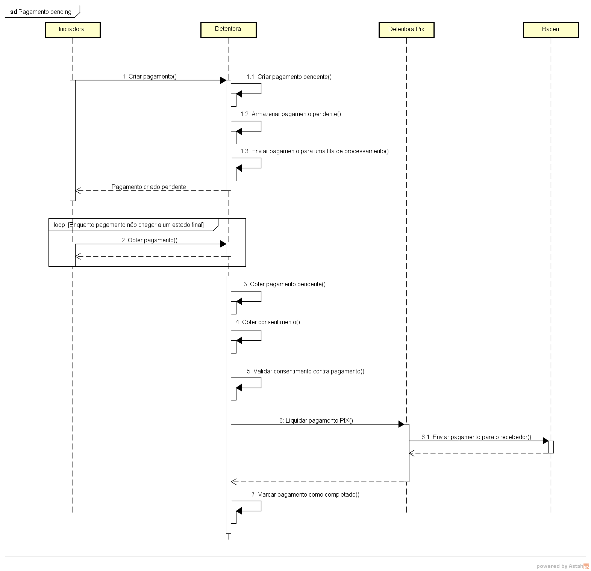
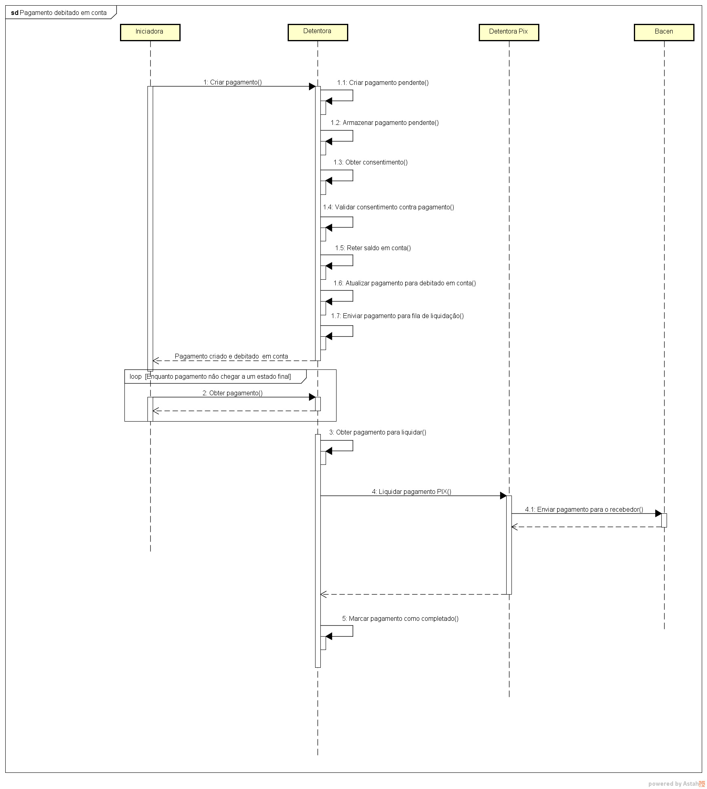

# Cenários de teste e requisições não determinísticas

Toda a api da iniciação de pagamentos foi construída para ser o mais flexível do ponto de vista
de implementação de back-end, suportando tanto fluxos síncronos como fluxos assícronos se valendo de máquinas de estado vinculada a cada recurso sendo criado.  
Isso acarreta que requisições não devem ser encaradas como determinísticas, mas sim interpretativas do ponto de vista de respostas da api.
Ao analisar alguns cenários da sensidea e como motor de certificação funcional está sendo construído, me deu a impressão que a abordagem determinística foi adotada o que faria
com as instituições fossem obrigadas a escrever as suas jornadas de back-end de uma forma única contrariando a flexibilidade da especificação.  
Observem abaixo dois exemplos dentre os diversos fluxos possíveis de implementação de backend para o endpoint de pagamentos coesos com a nossa especificação.  

## Fluxo 1 - Resposta com pagamento em status PENDING

## Fluxo 2 - Resposta com pagamento em status ACCEPTED_SETTLEMENT_COMPLETED_DEBITOR_ACCOUNT

No primeiro cenário, a detentora devolveu o pagamento com status **PDNG** indicando que o processo de validação de negócio inicial ainda está em processamento.  
No segundo cenário, a detentora devolveu o pagamento com status **ACSC** indicando que o débito na conta do cliente já foi feito e que a validação inicial de negócio também foi realizada. Note que neste caso o consentimento já foi consultado e validado sincronamente na mesma requisição de pagamento.  

Os dois casos de sucesso já tem payloads de resposta distintos, portanto, **não** determinísticos por conta do valor status derivado da escolha de caminho de implementação da detentora.  
Os casos ficam mais distantes considerando as duas jornadas se formos para cenários de erro de negócio. Para exemplificar vamos usar um consentimento já com o status **CONSUMED** .  
No primeiro fluxo de implementação a resposta não mudaria do caso de sucesso (HTTP 201) e posteriormente o **get** do pagamento iria ter um status RJCT com o campo rejectReason com o valor **INVALID_CONSENT** .  
No segundo fluxo de implementação a resposta seria um erro com o status HTTP 422 com o campo code com o valor **CONSENTIMENTO_INVALIDO**. Neste cenário nem o pagamento é criado.  

Essa análise foi feita com intuito de mostrar que os cenários de testes devem revistos com essa ótica de interpretar as situações ao invés de assumir respostas determinísticas.
