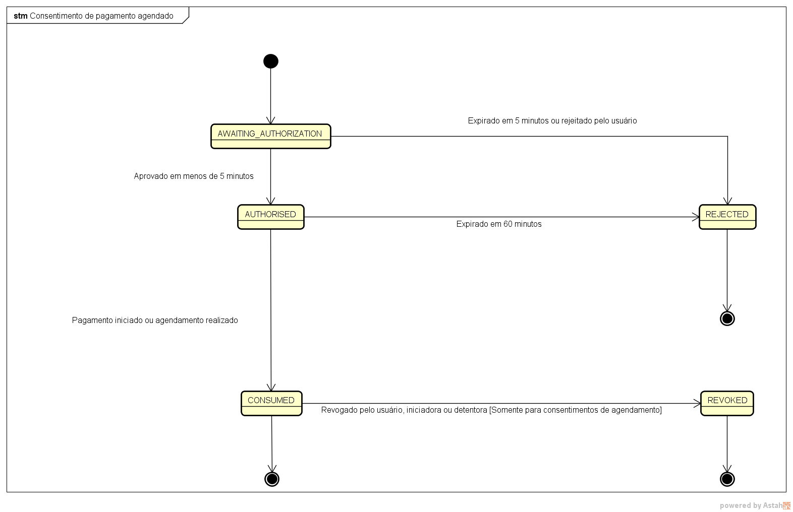
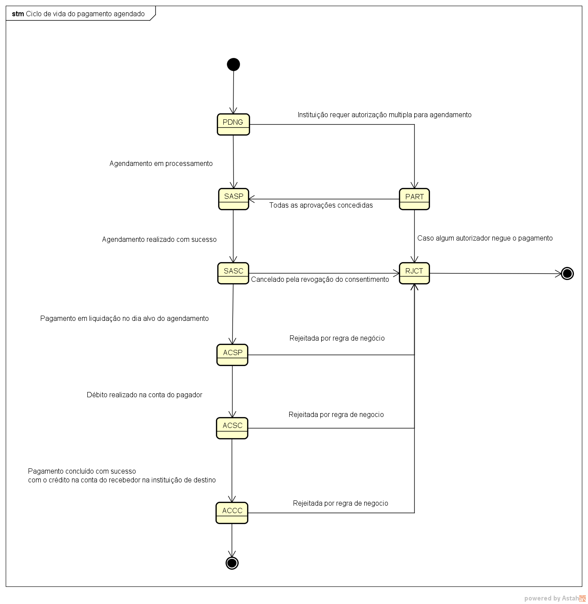

# Indices
- [Introdução](#introdução)
- [Ciclos de vida](#ciclo-de-vida-de-consentimentos-e-pagamentos-agendados)
  - [Consentimento](#consentimento)
  - [Pagamento](#pagamento)
- [Controle de Acesso](#controle-de-acesso)
- [Agendamento de pagamentos](#agendamento-de-pagamentos)
  - [Jornada](#jornada)
  - [Endpoints](#endpoints)
    - [Criar consentimento](#criar-consentimento)
    - [Consultar consentimento](#consultar-consentimento)
    - [Criar pagamento PIX](#criar-pagamento-pix)
    - [Consultar pagamento PIX](#consultar-pagamento-pix)
  - [Mecanismo de retentativas de liquidação de pagamentos agendados](#mecanismo-de-retentativas-de-liquidao-de-pagamentos-agendados)
- [Revogação do consentimento](#revogao-do-consentimento)
  - [Endpoints](#endpoint)
    - [Revogar consentimento](#revogar-consentimento)
    - [Consultar consentimento](#consultar-consentimento-revogado)
    - [Consultar pagamento agendado PIX](#consultar-pagamento-pix)
- [Regra de negócio](#regras-de-negcio)
 
  
# Introdução
  Esta proposta visa adicionar suporte a agendamento de pagamentos para datas futuras tendo como 
  alvo inicial o suporte a pagamento agendados únicos (Sem recorrência) para o arranjo Pix, contudo pavimentando a possibilidade
  de adição de semelhante funcionalidade a outros meios de pagamentos posteriormente, pois as mudanças principais estão no consentimento.  
  Toda a proposta fora escrita tendo o controle do mecanismo de agendamento junto as detentoras de contas.  

# Ciclo de vida de consentimentos e pagamentos agendados

  Para suportar a funcionalidade de agendamento serão necessárias alterações nas máquinas de estado dos recursos de consentimento e pagamentos.  
  
## Consentimento 
  Para suportar a possibilidade de revogação do consentimento o novo status **REVOKED** será adicionado ao schema: [EnumAuthorisationStatusType](https://openbanking-brasil.github.io/areadesenvolvedor/#tocS_EnumAuthorisationStatusType).  
  O status **CONSUMED** do consentimento não será mais um estado final em consentimentos para pagamentos agendados,
  pois poderá ser alterado para o novo status **REVOKED** caso algum dos participantes da transação (Usuário final, Iniciadora ou Detentora) 
  decida por cancelar o pagamento antes de ser liquidado.  

  

## Pagamento
  Para suportar a noção de agendamento serão adicionados dois novos status ao recurso de pagamentos pix listados abaixo o schema: [EnumPaymentStatusType](https://openbanking-brasil.github.io/areadesenvolvedor/#tocS_EnumPaymentStatusType).
  1. **SASP (SCHEDULE_ACCEPTED_SETTLEMENT_IN_PROCESS)** 
  2. **SASC (SCHEDULE_ACCEPTED_SETTLEMENT_COMPLETED)**  

  Estes dois novos status indicam respectivamente que o processo de agendamento está em processamento e o segundo que o agendamento foi realizado.  
  O primeiro status faculta a possibilidade das detentoras implementarem um fluxo assíncrono de agendamento.  
  No dia alvo do agendamento o pagamento será liquidado com os preceitos já estabelecidos da máquina estados do pagamento.  

  

# Controle de acesso
  A funcionalidade agendamento não introduz novas necessidades de controle de acesso ao que já é praticado na modalidade de pagamentos normais.  
  Nesta sessão apenas gostaríamos de ratificar que o controle do tempo de vida máximo dos access tokens obtidos pelo processo de hybrid flow estão vinculados ao tempo de expiração do consentimento, deste modo  
  a iniciadora poderá obter novos Acces-Tokens através do seu Reflesh Token até que o consentimento atinga sua data de expiração.

# Agendamento de pagamentos
  A funcionalidade de agendamento proposta apenas permite agendamentos para pagamentos únicos, ou seja, sem recorrência.  
  O suporte a recorrência será estudado no futuro caso haja necessidade.  

## Jornada
  A jornada para realizar agendamentos de pagamentos fundamentalmente é semelhante à jornada de um pagamento normal  
  facilitando o processo de suporte a funcionalidade.

  

## Endpoints

   Para suportar o agendamento todos os endpoints envolvidos no processo de pagamentos normais sofrerão alterações.  

### Criar consentimento
  
  **POST /payments/v1/consents**
  
  Os consentimentos criados por este endpoint terão a adição de novo objeto que írá conter os dados do agendamento conforme descrito adiante.  
  Este novo objeto está sendo adicionado ao consentimento, portanto, agnóstico aos tipos de pagamentos, ou seja, PIX, TED/TEF e outros arranjos  
  irão reutilizar o aqui definido.
  
  **Fragmento do consentimento com a estrutura do objeto de agendamento**
```
{
   "data":{
      "payment":{
         "type":"PIX",
         "schedule":{
            "single":{
               "date":"2035-01-01"
            }
         }
      }
   }
}
```
  Campo **schedule** foi adicionado para permitir que o novo objeto de agendamento seja descrito.  
  Descrição dos campos:  
  
  |**Campo**|**Tipo**|**Requerido**|**Descrição**|Regras de negócio|
  |----------|------|---------|--------------------------------------------------------|---------|
  |**data.payment.schedule**|objeto|condicionalmente|Define o agendamento do pagamento. Utilizado somente na funcionalidade de agendamento de pagamentos|N/A|
  |**data.payment.schedule.single**|objeto|sim|Define a política de agendamento único|N/A|
  |**data.payment.schedule.single.date**|string(date)|sim|Define a data alvo da liquidação do pagamento.O fuso horário de Brasilia deve ser utilizado para criação e racionalização sobre os dados deste campo|[RN101](#regras-de-validação), [RN103](#regras-de-validação)|
  
   **Regras de negócio**
   1. [RN001](#regras-funcionais)

### Consultar consentimento
  
  **GET /payments/v1/consents/{consentId}**

  Todos os novos dados mencionados no endpoint de criação do consentimento também estarão presentes na resposta positiva deste endpoint.  
  
### Criar pagamento pix

  **POST /payments/v1/pix/payments**
  
  Nenhuma mudança estrutural neste endpoint será feita para realizar o agendamento. Apenas será incluído os novos status conforme descrito em [Ciclo de vida](#ciclo-de-vida-de-consentimentos-e-pagamentos-agendados)  
  
### Consultar pagamento PIX
  
  **GET /payments/v1/pix/payments/{paymentId}**

  Nenhuma mudança estrutural neste endpoint será feita para realizar o agendamento. Apenas será incluído os novos status conforme descrito em [Ciclo de vida](#ciclo-de-vida-de-consentimentos-e-pagamentos-agendados) e motivos de rejeição.

## Mecanismo de retentativas de liquidação de pagamentos agendados

  No momento da liquidação de pagamentos agendados é possível ter falhas sistêmicas ou violações de regras de negócio passiveis de recuperação em segundo momento 
  como, por exemplo, ausência de saldo na conta do pagador para realizar a liquidação. Neste contexto poderia ser interessante as detentoras de conta a adoção de políticas de retentativa de liquidação.  
  O arranjo PIX não define nada a respeito deste tema, então por consequência o Open Banking deixa livre para cada detentora adotar a política
  de retentativa que mais fazer sentido para ela. 

# Revogação do consentimento

  Com a inclusão da funcionalidade agendamento é interessante facultar para as partes envolvidas na transação a possibilidade de cancelamento do pagamento agendado antes da sua liquidação futura.  
  Esse mecanismo de cancelamento do pagamento agendado será oferecido a partir da revogação de consentimentos para pagamentos agendados.
  Considerando a diretriz do controle do agendamento pela detentora de conta e as necessidades dos envolvidos na transação e possível as seguintes possibilidades de jornadas de revogação.

1. Revogação **pelo usuário na iniciadora** na área de gestão de pagamentos do open banking (Consulte o guia de UX do Open Banking para maiores detalhes) 
2. Revogação **pelo usuário na detentora** na área de gestão de pagamentos do open banking (Consulte o guia de UX do Open Banking para maiores detalhes)
3. Revogação **pelo usuário na detentora** na área de gestão de Pix (Consulte o guia de UX do arranjo PIX para maiores detalhes)
4. Revogação pela iniciadora sem a presença do usuário
5. Revogação pela detentora sem a presença do usuário

## Endpoint
  Para incluir a funcionalidade revogação do consentimento será necessário a inclusão de um novo endpoint e a alteração do endpoint de consulta do consentimento descritos a seguir.
  Os dados do consentimento terão uma expansão para capturar as circunstâncias da revogação tornando claro ocorrido para todas as partes envolvidas.

### Revogar consentimento

  **PATCH /payments/v1/consents/{consentId}**  
 
  **Parâmetros**  

  |Nome|Origem|Tipo|Requerido|Descrição|
  |-----------------|----------|------------|---------|---------------------------------------------------------------------------------------------------------------------------|
  |**consentId**|path|string|sim|O consentId é o identificador único do consentimento a ser revogado e deverá ser um URN - Uniform Resource Name.|
  |**Authorization**|header|string|sim|Cabeçalho HTTP padrão. Permite que as credenciais sejam fornecidas dependendo do tipo de recurso solicitado.|
  |**x-fapi-auth-date**|header|string|não|Data em que o usuário logou pela última vez com o receptor. Representada de acordo com a RFC7231.Exemplo: Sun, 10 Sep 2017 19:43:31 UTC|
  |**x-fapi-customer-ip-address**|header|string|não|O endereço IP do usuário se estiver atualmente logado com o receptor.|
  |**x-fapi-interaction-id**|header|string|não|Um UID RFC4122 usado como um ID de correlação. Se fornecido, o transmissor deve "reproduzir" esse valor no cabeçalho de resposta.|
  |**x-idempotency-key**|header|string|sim|Cabeçalho HTTP personalizado. Identificador de solicitação exclusivo para suportar a idempotência.|
  |**x-customer-user-agent**|header|string|não|Indica o user-agent que o usuário utiliza.|
  
  **Payload de requisição**

```
{
   "data":{
      "status":"REVOKED",
      "revocation":{
         "loggedUser":{
            "document":{
               "identification":"11111111111",
               "rel":"CPF"
            }
         },
         "revoked_by":"USER",
         "reason":{
            "code":"OTHER",
            "additionalInformation":"Não quero mais o serviço"
         }
      }
   }
}
```
  **Descrição dos campos**

  |**Campo**|**Tipo**|**Requerido**|**Descrição**|Regras de negócio|
  |----------|------|---------|---------------------------------------------------------------------------------------------------------------|---------|
  |**data.status**|enumerado(string) - [EnumAuthorisationStatusType](https://openbanking-brasil.github.io/areadesenvolvedor/#tocS_EnumAccountPaymentsType)|sim|Status para qual o consentimento seguirá. Apenas o valor **REVOKED** será suportado no momento|[RN100](#regras-de-validação)|
  |**data.revocation**|objeto|sim|Objeto que contém as informações das circunstância da revogação|N/A|
  |**data.revocation.loggedUser**|objeto|condicionalmente|Representa o usuário (pessoa natural) que encontra-se logado na instituição Iniciadora de Pagamento.|[RN104](#regras-de-validação)|
  |**data.revocation.loggedUser.document**|objeto|sim|Objeto que contém os dados de identificação do usuário.|N/A|
  |**data.revocation.loggedUser.document.identification**|string|sim|Número do documento de identificação oficial do usuário.|N/A|
  |**data.revocation.loggedUser.document.rel**|string|sim|Tipo do documento de identificação oficial do usuário.|N/A|
  |**data.revocation.revoked_by**|enumerado(string)|sim|Define qual das partes envolvidas na transação está realizando a revogação. Valores possíveis: **USER** (Revogado pelo usuário), **ASPSP** (Provedor de serviços de pagamento para serviços de conta - Detentora de conta), **TPP** (Instituições Provedoras - iniciadora de pagamentos).|N/A|
  |**data.revocation.reason**|objeto|sim|Define a razão pela qual o consentimento foi revogado|N/A|
  |**data.revocation.reason.code**|enumerado(string)|sim|Define o código da razão pela qual o consentimento foi revogado. Valores possíveis: **FRAUD** (Indica suspeita de fraude), **ACCOUNT_CLOSURE** (Indica que a conta do usuário foi encerrada), **OTHER** (Indica que motivo do cancelamento está fora dos motivos pré-estabelecidos) |[RN108](#regras-de-validação)|
  |**data.revocation.reason.additionalInformation**|string(máximo: 255 Caracteres)|condicionalmente|Contém informações adicionais definidas pelo requisitante da revogação|[RN109](#regras-de-validação)|

  **Controle de acesso**

  Este endpoint deve suportar apenas ser chamado usando client credentials.

  **Regras de negócio**

  1.[RN002](#regras-funcionais)

### Consultar consentimento revogado

  **GET /payments/v1/consents/{consentId}**  

  Todos os novos dados mencionados no endpoint de revogação do consentimento também estarão presentes na resposta positiva deste endpoint.

### Consultar pagamento agendado PIX

**GET /payments/v1/pix/payments/{paymentId}**

Nenhuma mudança estrutural neste endpoint será feita para realizar a revogação.  
Apenas será incluído um novo motivo de rejeição: **CONSENT_REVOKED** para mostrar que o pagamento foi cancelado devido à revogação do consentimento.
os novos status conforme descrito em [Ciclo de vida](#ciclo-de-vida-de-consentimentos-e-pagamentos-agendados)


## Regras de negócio
    
  Nesta sessão serão listadas todas as regras de negócio envolvidas nos endpoints citados nas sessões anteriores.

### Regras funcionais

|**Código**|**Descrição**|Endpoint|
|----------|-----------------------------------------------------------------------------------------------------------|------------|
|**RN001**|Ao revogar um consentimento o pagamento associado deverá ir para o status **RJCT** e campo **rejectionReason** deverá ter o valor **CONSENT_REVOKED**. Schema: [EnumRejectionReasonType](https://openbanking-brasil.github.io/areadesenvolvedor/#tocS_EnumRejectionReasonType) |[Revogar consentimento](#revogar-consentimento)|


### Regras de validação

|**Código**|**Descrição**|Endpoint|Resposta HTTP|Código de Erro|Título|Mensagem|Schema|
|----------|------------------------------------------------------------------------------------------------------------------------------------------|-----------------|-------|----------------|--------------------------|-----------------------------|--------------------------|
|**RN101**|O campo **data.payment.schedule.single.date** deverá sempre ser no mínimo D+1 corrido, ou seja, a data imediatamente posterior em relação a data do consentimento considerando o fuso horário de Brasília|[Criar consentimento](#criar-consentimento)|422|**INVALID_SCHEDULE**|Agendamento inválido|Agendamento inválido|[422ResponseErrorCreateConsent](https://openbanking-brasil.github.io/areadesenvolvedor/#tocS_422ResponseErrorCreateConsent)|
|**RN102**|O campo **data.status** na revogação do consentimento só deverá aceitar o valor **REVOKED**|[Revogar consentimento](#revogar-consentimento)|400|Livre|Livre|Livre|[ResponseError](https://openbanking-brasil.github.io/areadesenvolvedor/#tocS_ResponseError)|
|**RN103**|O campo **data.payment.schedule.single.date** deverá ser no máximo um ano corrido a partir da data do consentimento considerando o fuso horário de Brasília|[Criar consentimento](#criar-consentimento)|422|**INVALID_SCHEDULE**|Agendamento inválido|Agendamento inválido|[422ResponseErrorCreateConsent](https://openbanking-brasil.github.io/areadesenvolvedor/#tocS_422ResponseErrorCreateConsent)|
|**RN104**|O campo **data.revocation.loggedUser** deve ser preenchidos quando a revogação for feita pelo usuário final, ou seja, se o campo **data.revocation.revoked_by** estiver com o valor **USER**|[Revogar consentimento](#revogar-consentimento)|422|USER_INFORMATION_REQUIRED|Informação do usuário requerida|Informação do usuário requerida|[422ResponseErrorCreateConsent](https://openbanking-brasil.github.io/areadesenvolvedor/#tocS_422ResponseErrorCreateConsent)|
|**RN105**|O consentimento só pode ser revogado nos status **CONSUMED**|[Revogar consentimento](#revogar-consentimento)|422|OPERATION_NOT_ALLOWED_BY_STATUS|Operação não permitida|Operação não permitida devido ao status atual do consentimento|[422ResponseErrorCreateConsent](https://openbanking-brasil.github.io/areadesenvolvedor/#tocS_422ResponseErrorCreateConsent)|
|**RN106**|Somente consentimentos para pagamentos agendados podem ser revogados, ou seja, que possuam o campo **data.payment.schedule** preenchido|[Revogar consentimento](#revogar-consentimento)|422|OPERATION_NOT_SUPPORTED_BY_CONSENT_TYPE|Operação não permitida|Operação não suportada pelo tipo de consentimento|[422ResponseErrorCreateConsent](https://openbanking-brasil.github.io/areadesenvolvedor/#tocS_422ResponseErrorCreateConsent)|
|**RN107**|O consentimento só pode ser revogado até o dia anterior, ou seja, a meia noite no fuso horário de Brasília do dia imediatamente anterior a data alvo da liquidação do pagamento|[Revogar consentimento](#revogar-consentimento)|422|REVOCATION_TIME_LIMIT_EXCEEDED|Prazo limite para revogação excedido|Prazo limite para revogação excedido|[422ResponseErrorCreateConsent](https://openbanking-brasil.github.io/areadesenvolvedor/#tocS_422ResponseErrorCreateConsent)|
|**RN108**|Os motivos de revogação do consentimento: **FRAUD** e **ACCOUNT_CLOSURE** só podem ser usados caso o campo: **data.revocation.revoked_by** tenha o valor **TPP** ou **ASPSP**, ou seja, somente no caso de revogação unilateral pela iniciadora ou detentora|[Revogar consentimento](#revogar-consentimento)|422|REVOCATION_REASON_NOT_ALLOWED|Motivo de revogação não permitido|Motivo de revogação não permitido|[422ResponseErrorCreateConsent](https://openbanking-brasil.github.io/areadesenvolvedor/#tocS_422ResponseErrorCreateConsent)|
|**RN109**|O campo **data.revocation.reason.additionalInformation** é obrigatório quando a revogação for feita pela iniciadora ou pela detentora unilateralmente, ou seja, o campo revoked_by igual a **TPP** ou **ASPSP** e o motivo de revogação for **OTHER**|[Revogar consentimento](#revogar-consentimento)|422|REVOCATION_ADDITIONAL_INFORMATION_REQUIRED|Informação adicional requerida|Informação adicional requerida|[422ResponseErrorCreateConsent](https://openbanking-brasil.github.io/areadesenvolvedor/#tocS_422ResponseErrorCreateConsent)|
