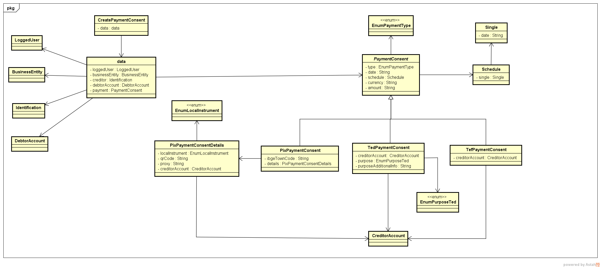

# Indices
- [Introdução](#introdução)
- [Consentimento](#consentimento)
  - [Criar consentimento](#criar-consentimento)
    - [Estruturação do payload de requisição](#estruturação-do-payload-de-requisição)
  - [Ciclo de vida](#ciclo-de-vida-do-consentimento)
  - [Agendamento](#agendamento)
- [Pagamento](#pagamento)
  - [Criar pagamento](#criar-pagamento)
- [Regras de negócio](#regras-de-negcio)


# Introdução
   Esta proposta visa adicionar suporte a iniciação de pagamentos através do arranjo de **TED (Transferência Eletrônica Disponível) e TEF (Transferência Eletrônica de Fundos)**.  
   **TED** é um arranjo de pagamentos que permite a realização de transferências financeiras entre instituições detentoras de contas no Banco Central.  
   **TEF** é um arranjo de pagamentos que permite a realização de transferências financeiras entre contas dentro de uma mesma instituição financeira.  


# Consentimento
   Para realizar uma iniciação de pagamento através de qualquer arranjo de pagamentos pelo Open Banking é necessário a criação de um consentimento que representa o desejo do usuário
   de permitir que sejam utilizados recursos financeiros em uma das suas contas presentes em uma detentora de conta por uma iniciadora de pagamentos.  
   Este conceito já é utilizado no Open Banking em face de outros arranjos de pagamentos e agora será expandido para suporte aos dois novos arranjos apresentados nesta proposta.  
   O consentimento é criado via endpoint [REST](https://pt.wikipedia.org/wiki/REST) e o seu funcionamento para adição do suporte a **TED/TEF** será detalhado a seguir.  

## Criar consentimento
  - **Path** : POST - /payments/v1/consents  
  - **Request Payload** : [CreatePaymentConsent](https://openbanking-brasil.github.io/areadesenvolvedor/#tocS_CreatePaymentConsent)
  - **HTTP 200 Response Payload**: [ResponsePaymentConsent](https://openbanking-brasil.github.io/areadesenvolvedor/#tocS_ResponsePaymentConsent)
  - **HTTP 422 Response Payload**: [422ResponseErrorCreateConsent](https://openbanking-brasil.github.io/areadesenvolvedor/#tocS_422ResponseErrorCreateConsent)  

O payload de requisição deste endpoint deverá ser expandido para suportar os dados necessários para os novos arranjos propostos.  
Antes de ser apresentado as expansões necessárias para cada arranjo será descrita uma reestruturação da composição do objeto requisição deste endpoint com finalidade de tornar mais clara a documentação do mesmo em face das necessidades específicas de cada arranjo suportado atualmente e os vindouros.  

### Estruturação do payload de requisição

Para facilitar a compreensão da nova estrutura proposta de payload e as relações entre os elementos que o compõe será utilizado o diagrama de classes abaixo.  

  

Toda a mudança proposta apresentada no diagrama se concentra no campo **data.payment** do schema **CreatePaymentConsent**.  
O schema desse campo (**PaymentConsent**) se tornaria uma estrutura [polimórfica](https://pt.wikipedia.org/wiki/Polimorfismo_(ci%C3%AAncia_da_computa%C3%A7%C3%A3o)) abstrata com três schemas concretos: **PixPaymentConsent**, **TedPaymentConsent** e **TefPaymentConsent** respectivamente para os arranjos **PIX**, **TED** e **TEF**.  
O campo determinante ([discriminator](https://swagger.io/docs/specification/data-models/inheritance-and-polymorphism/)) de qual schema apropriado será o **type** .   
Uma conjectura surge a partir desta proposta que seria a não necessidade de existir um campo **details** para Pix visto que tudo poderia estar simplesmente definido no **PixPaymentConsent** diminuindo a profundidade do payload, contudo, neste momento essa alteração acarretaria em quebra de contrato de API o que é muito complexo de ser absorvido pelo ecossistema agora.  

Abaixo são apresentados fragmentos de payloads de consentimentos contendo a utilização dos três novos schemas com toda a informação disponível em cada um deles.  
Também serão descritos os campos novos, ou seja, introduzidos pelos novos arranjos. 

**PIX**  
```
{
   "data":{
      "payment":{
         "type":"PIX",
         "date":"2021-01-01",
         "schedule":{
            "single":{
               "date":"2021-01-01"
            }
         },
         "currency":"BRL",
         "amount":"100000.12",
         "ibgeTownCode":"5300108",
         "details":{
            "localInstrument":"DICT",
            "qrCode":"00020104141234567890123426660014BR.GOV.BCB.PIX014466756C616E6F32303139406578616D706C652E636F6D27300012\nBR.COM.OUTRO011001234567895204000053039865406123.455802BR5915NOMEDORECEBEDOR6008BRASILIA61087007490062\n530515RP12345678-201950300017BR.GOV.BCB.BRCODE01051.0.080450014BR.GOV.BCB.PIX0123PADRAO.URL.PIX/0123AB\nCD81390012BR.COM.OUTRO01190123.ABCD.3456.WXYZ6304EB76\n",
            "proxy":"12345678901",
            "creditorAccount":{
               "ispb":"12345678",
               "issuer":"1774",
               "number":"1234567890",
               "accountType":"CACC"
            }
         }
      }
   }
}
```

**TED**

```
{
   "data":{
      "payment":{
         "type":"TED",
         "date":"2021-01-01",
         "schedule":{
            "single":{
               "date":"2021-01-01"
            }
         },
         "currency":"BRL",
         "amount":"100000.12",
         "creditorAccount":{
            "ispb":"12345678",
            "issuer":"1774",
            "number":"1234567890",
            "accountType":"CACC"
         },
         "purpose":1,
         "purposeAdditionalInfo":"Informações adicionais"
      }
   }
}
```
**Campos novos do payload para TED**

|**Campo**|**Tipo**|**Requerido**|**Descrição**|Regras de negócio|
|----------|------|---------|--------------------------------------------------------|---------|
|**data.payment.purpose**|enumerado(string) - EnumPurposeTed|sim|Define a finalidade da transferência. O domínio deste enumerado está no [anexo](lista-de-finalidades.txt)|N/A|
|**data.payment.purposeAdditionalInfo**|string|condicionalmente|Define o complemento da finalidade da transferência de forma textual.|[RN301](#regras-de-validação)|


**TEF**
```
{
   "data":{
      "payment":{
         "type":"TEF",
         "date":"2021-01-01",
         "schedule":{
            "single":{
               "date":"2021-01-01"
            }
         },
         "currency":"BRL",
         "amount":"100000.12",
         "creditorAccount":{
            "ispb":"12345678",
            "issuer":"1774",
            "number":"1234567890",
            "accountType":"CACC"
         }
      }
   }
}
```

A iniciação de pagamentos para TED não suporta todos os tipos de contas de crédito disponíveis pelo Open Banking, sendo suportado somente conta corrente, poupança e pagamentos ([RN302](#regras-de-validação)).  
O arranjo de TED possui uma grade de horários definida de funcionamento pelo Bacen. Além disso, muitas instituições limitam ainda mais a grade de funcionamento deste arranjo nos seus canais de oferta de TED, portanto esse aspectos precisam ser validados no momento do consentimento ([RN303](#regras-de-validação)).  
Tanto o arranjo TED quanto TEF podem apresentar restrições de limites para transferências estipuladas nas detentoras de conta, devendo isso ser considerado ao criar o consentimento([RN304](#regras-de-validação)).  
As alterações na requisição de criação do consentimento devem refletir também tanto na resposta do endpoint de criação de pagamento quanto na resposta do endpoint de busca do consentimento. 
   
  
## Ciclo de vida do consentimento
  Nenhuma alteração no ciclo de vida do consentimento será mudado para inclusão dos novos arranjos.  

## Agendamento
  Todas regras e fluxos envolvendo o agendamento de pagamentos também se aplicarão aos dois novos arranjos.   


# Pagamento

   O pagamento representa a execução do consentimento dado pelo cliente.  
   Ele pode tanto ter uma liquidação imediata quanto pode ser postergada para um momento no futuro definido pelo cliente.  
   Para dar suporte aos novos arranjos de TED/TEF será necessário a criação de novos endpoints REST que viabilizarão o fluxo de pagamento a partir das iniciadoras de pagamentos se forma análoga ao que hoje já praticado no PIX.  

## Criar Pagamento
- **Path** : POST - /payments/v1/ted-tef/payments
- **Parâmetros** : 

  |Nome|Origem|Tipo|Requerido|Descrição|
  |-----------------|----------|------------|---------|---------------------------------------------------------------------------------------------------------------------------|
  |**Authorization**|header|string|sim|Cabeçalho HTTP padrão. Permite que as credenciais sejam fornecidas dependendo do tipo de recurso solicitado.|
  |**x-fapi-auth-date**|header|string|não|Data em que o usuário logou pela última vez com o receptor. Representada de acordo com a RFC7231.Exemplo: Sun, 10 Sep 2017 19:43:31 UTC|
  |**x-fapi-customer-ip-address**|header|string|não|O endereço IP do usuário se estiver atualmente logado com o receptor.|
  |**x-fapi-interaction-id**|header|string|não|Um UID RFC4122 usado como um ID de correlação. Se fornecido, o transmissor deve "reproduzir" esse valor no cabeçalho de resposta.|
  |**x-idempotency-key**|header|string|sim|Cabeçalho HTTP personalizado. Identificador de solicitação exclusivo para suportar a idempotência.|
  |**x-customer-user-agent**|header|string|não|Indica o user-agent que o usuário utiliza.|
  |**body**|body|objeto|sim|Dados para a criação do pagamento de TED ou TEF.|

- **Payload** : 
  ```
  {
   "data":{
      "payment":{
         "amount":"100000.12",
         "currency":"BRL"
      },
      "creditorAccount":{
         "ispb":"12345678",
         "issuer":"1774",
         "number":"1234567890",
         "accountType":"CACC"
      },
      "purpose":1,
      "purposeAdditionalInfo":"Informações adicionais"
   }
  }
  ```
- **Campos** :

  |**Campo**|**Tipo**|**Requerido**|**Descrição**|**Regras de negócio**|
  |----------|------|---------|---------------------------------------------------------------------------------------------------------------|---------|
  |**data.payment**|objeto - Payment|sim|Representa os dados financeiros do pagamento.|N/A|
  |**data.payment.amount**|string|sim|Valor da transação com 2 casas decimais.|N/A| 
  |**data.payment.currency**|string|sim|Código da moeda nacional segundo modelo ISO-4217, ou seja, 'BRL'. Todos os valores monetários informados estão representados com a moeda vigente do Brasil.|N/A| 
  |**data.creditorAccount**|objeto - TedTefCreditorAccount|sim|Representa a conta do recebedor da transferência financeira gerada pelo pagamento|N/A|
  |**data.creditorAccount.ispb**|string|sim|Representa o ISPB (Identificador do Sistema de Pagamentos Brasileiros) da instituição onde a conta do recebedor é domiciliada|N/A|
  |**data.creditorAccount.issuer**|string|condicionalmente|Código da Agência emissora da conta sem dígito. (Agência é a dependência destinada ao atendimento aos clientes, ao público em geral e aos associados de cooperativas de crédito, no exercício de atividades da instituição, não podendo ser móvel ou transitória). |[RN305](#regras-de-validação)|
  |**data.creditorAccount.number**|string|sim|Deve ser preenchido com o número da conta do usuário recebedor, com dígito verificador (se este existir), se houver valor alfanumérico, este deve ser convertido para 0.|N/A|
  |**data.creditorAccount.accountType**|enumerado(string)|sim|Descreve o tipo da conta que receberá o recursos provenientes da iniciação de pagamentos. Domínio: CACC - Current - Conta Corrente, SLRY - Salary - Conta-Salário, SVGS - Savings - Conta de Poupança, TRAN - TransactingAccount - Conta de Pagamento pré-paga.|N/A|
  |**data.purpose**|enumerado(string) - EnumPurposeTed|condicionalmente|Define a finalidade da transferência. O domínio deste enumerado está no [anexo](lista-de-finalidades.txt)|[RN306](#regras-de-validação)|
  |**data.purposeAdditionalInfo**|string - max length : 200|condicionalmente|Define o complemento da finalidade da transferência de forma textual.|[RN301](#regras-de-validação)|

- **Respostas** :
  - **HTTP 200**: Pagamento de TED/TEF criado com sucesso. 
  - **Payload**:  

# Regras de negócio

Nesta sessão serão listadas todas as regras de negócio envolvidas nos endpoints citados nas sessões anteriores.

## Regras funcionais

|**Código**|**Descrição**|**Endpoint**|**Resposta HTTP**|**Código de Erro**|**Título**|**Mensagem**|**Schema**|
|----------|------------------------------------------------------------------------------------------------------------------------------------------|-----------------|-------|----------------|--------------------------|-----------------------------|--------------------------|

## Regras de validação

|**Código**|**Descrição**|**Endpoint**|**Resposta HTTP**|**Código de Erro**|**Título**|**Mensagem**|**Schema**|
|----------|------------------------------------------------------------------------------------------------------------------------------------------|-----------------|-------|----------------|--------------------------|-----------------------------|--------------------------|
|**RN301**|O campo **data.payment.purposeAdditionalInfo** deverá ser preenchido apenas quando a **data.payment.purpose** tiver o valor 99999 - Outros|[Criar consentimento](#criar-consentimento)|422|**DETALHE_PGTO_INVALIDO**|Consentimento inválido|Complemento de finalidade requerida|[422ResponseErrorCreateConsent](https://openbanking-brasil.github.io/areadesenvolvedor/#tocS_422ResponseErrorCreateConsent)|
|**RN302**|O campo **data.payment.creditorAccount.accountType**  quando o arranjo alvo for TED só suportará os tipos **CACC** (Conta corrente), **SVGS** (Poupança) e **TRAN** (Conta de Pagamento pré-paga) |[Criar consentimento](#criar-consentimento)|422|**TIPO_CONTA_NAO_SUPORTADO**|Consentimento inválido|Tipo de conta não suportado pelo arranjo alvo|[422ResponseErrorCreateConsent](https://openbanking-brasil.github.io/areadesenvolvedor/#tocS_422ResponseErrorCreateConsent)|
|**RN303**|A detentora de conta deve validar se o consentimento para pagamento de TED está dentro de sua grade funcionamento para o arranjo|[Criar consentimento](#criar-consentimento)|422|**JANELA_HORARIO_NAO_PERMITIDA**|Consentimento inválido|Janela de horário do arranjo de pagamento alvo não permitida|[422ResponseErrorCreateConsent](https://openbanking-brasil.github.io/areadesenvolvedor/#tocS_422ResponseErrorCreateConsent)|
|**RN304**|A detentora de conta deve validar se o consentimento para pagamento de TED ou TEF está com o valor dentro dos limites de transferência por ela estabelecidos|[Criar consentimento](#criar-consentimento)|422|**VALOR_ACIMA_LIMITE**|Consentimento inválido|O valor (ou quantidade de transações) ultrapassa a faixa de limite parametrizada na detentora para permitir a realização de transações pelo cliente.|[422ResponseErrorCreateConsent](https://openbanking-brasil.github.io/areadesenvolvedor/#tocS_422ResponseErrorCreateConsent)|
|**RN305**|O campo **data.creditorAccount.issuer** só é suportado pelos tipos de conta **CACC**, **SVGS** e **SLRY** e portanto obrigatório apenas nestes casos.|[Criar pagamento](#criar-pagamento)|422|**AGENCIA_REQUERIDA**|Pagamento inválido|O tipo de conta alvo requer as informações de agência|**422ResponseErrorCreateTedTefPayment**|
|**RN306**|O campo **data.purpose** é obrigatório quando o tipo de pagamento for do arranjo TED|[Criar pagamento](#criar-pagamento)|422|**FINALIDADE_REQUERIDA**|Pagamento inválido|Finalidade é requerida para o pagamento no arranjo alvo|**422ResponseErrorCreateTedTefPayment**|
